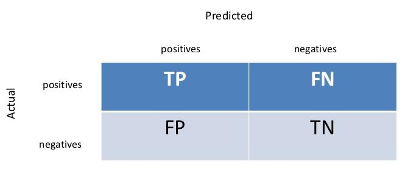

## Introducción
When you are building a predictive model, you need a way to evaluate the capability of the model on unseen data.

This is typically done by estimating accuracy using data that was not used to train the model such as a test set, or using cross validation. 

In order to measure the performance of a classification model on every class, whe have to compute the following values:

- True positives $TP$: Number of instances correctly classified in the class.
- False positives $FP$: Number of instances wrongly classified in the class.
- False negatives $FN$: Number of instances wrongly classified out of the class.
- True negatives $TN$: Number of instances correctly classified out of the class.

Usually this values are summarized in a table like the one below.



Using these values, we can define several measures of performance.
The most common are:

- Sensitivity: $$Sen=\frac{TP}{TP+FN}$$
- Specificity: $$Spe=\frac{TN}{FP+TN}$$
- Positive predicted value: $$PPV=\frac{TP}{TP+FP}$$
- Negative predicted value: $$NPV=\frac{TN}{FN+TN}$$
- Precission: Is the same than the positive predicted value.
- Recall: Is the same than sensitivity.
- F-measure: $$F=\frac{2Precision\cdot Recall}{Precission+Recall}$$
- Cohen's Kappa

The [caret]() package in R provides a number of methods to estimate the accuracy of a machines learning clasiffication model.

Here we present 5 methods for estimating model performance:

- Data Split
- Bootstrap
- k-fold Cross Validation
- Repeated k-fold Cross Validation
- Leave One Out Cross Validation

Generally, I would recommend Repeated k-fold Cross Validation, but each method has its features and benefits, especially when the amount of data or space and time complexity are considered. Consider which approach best suits your problem.

## Data Split

Data splitting involves partitioning the data into an explicit training dataset used to prepare the model and an unseen test dataset used to evaluate the models performance on unseen data.

It is useful when you have a very large dataset so that the test dataset can provide a meaningful estimation of performance, or for when you are using slow methods and need a quick approximation of performance.

The example below splits the iris dataset so that 80% is used for training a Naive Bayes model and 20% is used to evaluate the models performance.


```r
# load the libraries
library(caret)
library(klaR)
# load the iris dataset
data(iris)
# define an 80%/20% train/test split of the dataset
split=0.80
trainIndex <- createDataPartition(iris$Species, p=split, list=FALSE)
data_train <- iris[ trainIndex,]
data_test <- iris[-trainIndex,]
# train a naive bayes model
model <- NaiveBayes(Species~., data=data_train)
# make predictions
x_test <- data_test[,1:4]
y_test <- data_test[,5]
predictions <- predict(model, x_test)
# summarize results
confusionMatrix(predictions$class, y_test)
```

```
## Confusion Matrix and Statistics
## 
##             Reference
## Prediction   setosa versicolor virginica
##   setosa         10          0         0
##   versicolor      0          8         1
##   virginica       0          2         9
## 
## Overall Statistics
##                                           
##                Accuracy : 0.9             
##                  95% CI : (0.7347, 0.9789)
##     No Information Rate : 0.3333          
##     P-Value [Acc > NIR] : 1.665e-10       
##                                           
##                   Kappa : 0.85            
##  Mcnemar's Test P-Value : NA              
## 
## Statistics by Class:
## 
##                      Class: setosa Class: versicolor Class: virginica
## Sensitivity                 1.0000            0.8000           0.9000
## Specificity                 1.0000            0.9500           0.9000
## Pos Pred Value              1.0000            0.8889           0.8182
## Neg Pred Value              1.0000            0.9048           0.9474
## Prevalence                  0.3333            0.3333           0.3333
## Detection Rate              0.3333            0.2667           0.3000
## Detection Prevalence        0.3333            0.3000           0.3667
## Balanced Accuracy           1.0000            0.8750           0.9000
```

## Bootstrap

Bootstrap resampling involves taking random samples from the dataset (with re-selection) against which to evaluate the model. In aggregate, the results provide an indication of the variance of the models performance. Typically, large number of resampling iterations are performed (thousands or tends of thousands).

The following example uses a bootstrap with 10 resamples to prepare a Naive Bayes model.


```r
# load the library
library(caret)
# load the iris dataset
data(iris)
# define training control
train_control <- trainControl(method="boot", number=100)
# train the model
model <- train(Species~., data=iris, trControl=train_control, method="nb")
# summarize results
print(model)
```

```
## Naive Bayes 
## 
## 150 samples
##   4 predictor
##   3 classes: 'setosa', 'versicolor', 'virginica' 
## 
## No pre-processing
## Resampling: Bootstrapped (100 reps) 
## Summary of sample sizes: 150, 150, 150, 150, 150, 150, ... 
## Resampling results across tuning parameters:
## 
##   usekernel  Accuracy   Kappa    
##   FALSE      0.9480310  0.9211771
##    TRUE      0.9519791  0.9271880
## 
## Tuning parameter 'fL' was held constant at a value of 0
## Tuning
##  parameter 'adjust' was held constant at a value of 1
## Accuracy was used to select the optimal model using  the largest value.
## The final values used for the model were fL = 0, usekernel = TRUE
##  and adjust = 1.
```


## k-fold Cross Validation

The k-fold cross validation method involves splitting the dataset into k-subsets. For each subset is held out while the model is trained on all other subsets. This process is completed until accuracy is determine for each instance in the dataset, and an overall accuracy estimate is provided.

It is a robust method for estimating accuracy, and the size of k and tune the amount of bias in the estimate, with popular values set to 3, 5, 7 and 10.

The following example uses 10-fold cross validation to estimate Naive Bayes on the iris dataset.


```r
# load the library
library(caret)
# load the iris dataset
data(iris)
# define training control
train_control <- trainControl(method="cv", number=10)
# fix the parameters of the algorithm
grid <- expand.grid(.fL=c(0), .usekernel=c(FALSE))
# train the model
model <- train(Species~., data=iris, trControl=train_control, method="nb", tuneGrid=grid)
```

```
## Error: The tuning parameter grid should have columns fL, usekernel, adjust
```

```r
# summarize results
print(model)
```

```
## Naive Bayes 
## 
## 150 samples
##   4 predictor
##   3 classes: 'setosa', 'versicolor', 'virginica' 
## 
## No pre-processing
## Resampling: Bootstrapped (100 reps) 
## Summary of sample sizes: 150, 150, 150, 150, 150, 150, ... 
## Resampling results across tuning parameters:
## 
##   usekernel  Accuracy   Kappa    
##   FALSE      0.9480310  0.9211771
##    TRUE      0.9519791  0.9271880
## 
## Tuning parameter 'fL' was held constant at a value of 0
## Tuning
##  parameter 'adjust' was held constant at a value of 1
## Accuracy was used to select the optimal model using  the largest value.
## The final values used for the model were fL = 0, usekernel = TRUE
##  and adjust = 1.
```


## Repeated k-fold Cross Validation

The process of splitting the data into k-folds can be repeated a number of times, this is called Repeated k-fold Cross Validation. The final model accuracy is taken as the mean from the number of repeats.

The following example uses 10-fold cross validation with 3 repeats to estimate Naive Bayes on the iris dataset.


```r
# load the library
library(caret)
# load the iris dataset
data(iris)
# define training control
train_control <- trainControl(method="repeatedcv", number=10, repeats=3)
# train the model
model <- train(Species~., data=iris, trControl=train_control, method="nb")
# summarize results
print(model)
```

```
## Naive Bayes 
## 
## 150 samples
##   4 predictor
##   3 classes: 'setosa', 'versicolor', 'virginica' 
## 
## No pre-processing
## Resampling: Cross-Validated (10 fold, repeated 3 times) 
## Summary of sample sizes: 135, 135, 135, 135, 135, 135, ... 
## Resampling results across tuning parameters:
## 
##   usekernel  Accuracy   Kappa    
##   FALSE      0.9555556  0.9333333
##    TRUE      0.9577778  0.9366667
## 
## Tuning parameter 'fL' was held constant at a value of 0
## Tuning
##  parameter 'adjust' was held constant at a value of 1
## Accuracy was used to select the optimal model using  the largest value.
## The final values used for the model were fL = 0, usekernel = TRUE
##  and adjust = 1.
```

## Leave One Out Cross Validation

In Leave One Out Cross Validation (LOOCV), a data instance is left out and a model constructed on all other data instances in the training set. This is repeated for all data instances.

The following example demonstrates LOOCV to estimate Naive Bayes on the iris dataset.


```r
# load the library
library(caret)
# load the iris dataset
data(iris)
# define training control
train_control <- trainControl(method="LOOCV")
# train the model
model <- train(Species~., data=iris, trControl=train_control, method="nb")
# summarize results
print(model)
```

```
## Naive Bayes 
## 
## 150 samples
##   4 predictor
##   3 classes: 'setosa', 'versicolor', 'virginica' 
## 
## No pre-processing
## Resampling: Leave-One-Out Cross-Validation 
## Summary of sample sizes: 149, 149, 149, 149, 149, 149, ... 
## Resampling results across tuning parameters:
## 
##   usekernel  Accuracy   Kappa
##   FALSE      0.9533333  0.93 
##    TRUE      0.9600000  0.94 
## 
## Tuning parameter 'fL' was held constant at a value of 0
## Tuning
##  parameter 'adjust' was held constant at a value of 1
## Accuracy was used to select the optimal model using  the largest value.
## The final values used for the model were fL = 0, usekernel = TRUE
##  and adjust = 1.
```


## References

- [How To Estimate Model Accuracy in R Using The Caret Package](https://machinelearningmastery.com/how-to-estimate-model-accuracy-in-r-using-the-caret-package/)
- [Applied Predictive Modeling, Chapter 4.](http://appliedpredictivemodeling.com/)
